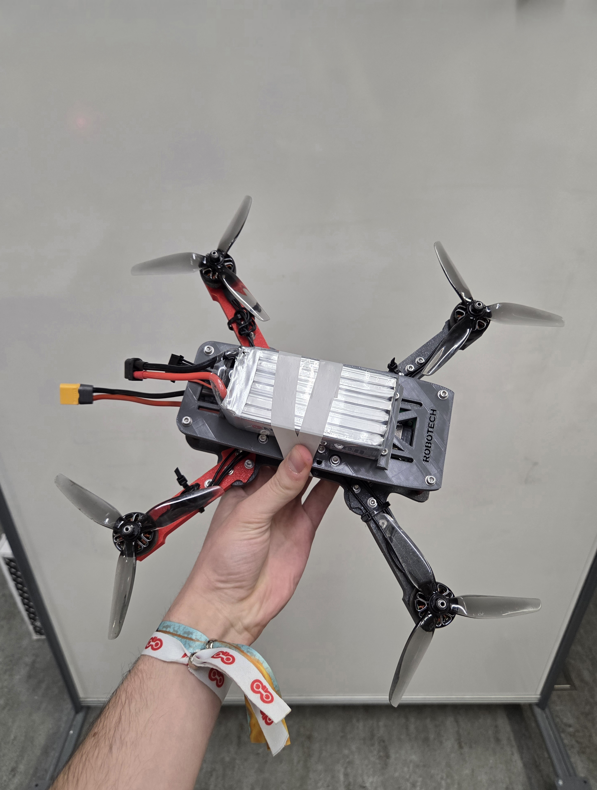

# Robotech Drone — 2025/2026

ESP32-based 5" drone built by the Robotech team. Attitude is estimated from a 9-axis IMU, then converted into motor commands through a PID loop. Control and telemetry go over the ESP32's built-in Wi-Fi (UDP).

## Approach

A 9-axis IMU (accelerometer, gyroscope, magnetometer) feeds a Madgwick AHRS filter to estimate attitude. Angular commands from that estimate drive the motors via DShot.

## Components

| Part         | Model                                      |
| ------------ | ------------------------------------------ |
| MCU          | ESP32 DevKit                               |
| Accel / Gyro | MPU-9265                                   |
| Magnetometer | GY-271 *(not-used)*                        |
| Motors       | XING-E Pro 2207 1800KV 2–6S (iFlight)      |
| ESC          | Hobbywing XRotor Micro 65A G2 4-in-1 AM32  |
| Battery      | LiPo GNB 6S 2200 mAh 120C — XT60 (Gaoneng) |
| Link         | ESP32 Wi-Fi (UDP)                          |
| Frame        | Designed in Fusion 360, 3D-printed         |
| PCB          | Designed in KiCad 9                        |

## Firmware

After library issues with DShot under ESP-IDF / PlatformIO, the flight code moved to **Arduino IDE** to use a more recent **DSHOTRMT** build. Firmware lives under `main/`.

A Qt-based ground station in `Emitter/QT_Controller/` connects over Wi-Fi and sends stick / config commands by UDP.

## Simulation

`Simulation/simulation.py` visualizes attitude estimation and the four motor responses so PID gains can be tuned offline.

## Media

<video src="Videos/20260323_190743.mp4" controls width="720"></video>

<video src="Videos/20260323_191418.mp4" controls width="720"></video>
